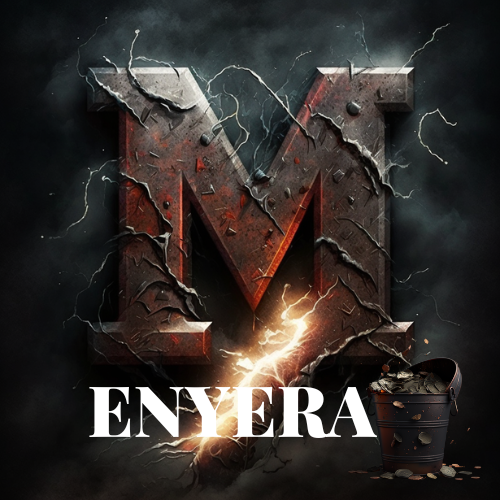

<a name="readme-top"></a>

<!--
HOW TO USE:
This is an example of how you may give instructions on setting up your project locally.

Modify this file to match your project and remove sections that don't apply.

REQUIRED SECTIONS:
- Table of Contents
- About the Project
  - Built With
  - Live Demo
- Getting Started
- Authors
- Future Features
- Contributing
- Show your support
- Acknowledgements
- License

OPTIONAL SECTIONS:
- FAQ

After you're finished please remove all the comments and instructions!
-->

<div align="center">
  <!-- You are encouraged to replace this logo with your own! Otherwise you can also remove it. -->
  
  <br/>

  <h3><b>Menyera README</b></h3>

</div>

<!-- TABLE OF CONTENTS -->

# 📗 Table of Contents

- [📖 About the Project](#about-project)
  - [🛠 Built With](#built-with)
    - [Tech Stack](#tech-stack)
    - [Key Features](#key-features)
  - [🚀 Live Demo](#live-demo)
- [💻 Getting Started](#getting-started)
  - [Setup](#setup)
  - [Prerequisites](#prerequisites)
  - [Install](#install)
  - [Usage](#usage)
  - [Run tests](#run-tests)
  - [Deployment](#triangular_flag_on_post-deployment)
- [👥 Authors](#authors)
- [🔭 Future Features](#future-features)
- [🤝 Contributing](#contributing)
- [⭐️ Show your support](#support)
- [🙏 Acknowledgements](#acknowledgements)
- [❓ FAQ (OPTIONAL)](#faq)
- [📝 License](#license)

<!-- PROJECT DESCRIPTION -->

# 📖 [Menyera] <a name="about-project"></a>

> Describe your project in 1 or 2 sentences.

**[Menyera]** This is a mobile web application designed to help users manage their budget effectively. With this app, users can view their transaction history, grouped by category, to easily track how much money they have spent and on what.

## The application will be built using Ruby on Rails and will provide the following features:

- User registration and login to ensure data privacy.
- Ability to input new transactions and categorize them accordingly.
- A dashboard to display spending by category, allowing users to quickly assess their spending habits.

## 🛠 Built With <a name="built-with"></a>

> built using Ruby on Rails

### Tech Stack <a name="tech-stack"></a>

### Rspec, unit tests, Rspec, Devise, Cancancan, Render.

<details>
  <summary>Client</summary>
  <ul>
    <li><a href="https://reactjs.org/">ROR</a></li>
  </ul>
</details>

<details>
  <summary>Server</summary>
  <ul>
    <li><a href="https://expressjs.com/">ROR</a></li>
  </ul>
</details>

<details>
<summary>Database</summary>
  <ul>
    <li><a href="https://www.postgresql.org/">PostgreSQL</a></li>
  </ul>
</details>

<!-- Features -->

### Key Features <a name="key-features"></a>

> Describe between 1-3 key features of the application.

- **[User registration and login to ensure data privacy]**
- **[Ability to input new transactions and categorize them accordingly]**
- **[A dashboard to display spending by category, allowing users to quickly assess their spending habits]**

<p align="right">(<a href="#readme-top">back to top</a>)</p>

<!-- LIVE DEMO -->

## 🚀 Live Demo <a name="live-demo"></a>

> Add a link to your deployed project.

- [Live Demo Link](https://last-3f0w.onrender.com/)

<p align="right">(<a href="#readme-top">back to top</a>)</p>

<!-- GETTING STARTED -->

## 💻 Getting Started <a name="getting-started"></a>

To get a local copy up and running, follow these steps.

### clone  [here](https://github.com/svitalis123/menyera.git)
- run bundle install
- run rails db:create
- run rails db:migrate

### Prerequisites

In order to run this project you need:
- rails s

### Setup

Clone this repository to your desired folder:

```sh
  cd menyera
  git clone @https://github.com/svitalis123/menyera.git
```
-

### Install

Install this project with:

```sh
  cd menyera
  bundle install
```
-

### Usage

To run the project, execute the following command:


```sh
  rails server
```

### Run tests

To run tests, run the following command:

```sh
  bin/rails test test/models/article_test.rb
```
-

### Deployment

You can deploy this project using:

- render

<p align="right">(<a href="#readme-top">back to top</a>)</p>

<!-- AUTHORS -->

## 👥 Author <a name="authors"></a>


👤 **Author1**

- GitHub: [@svitalis123](https://github.com/svitalis123)
- Twitter: [@WilsonVitalis](https://twitter.com/WilsonVitalis)
- LinkedIn: [vitalismutwiri](https://linkedin.com/in/vitalismutwiri)

<p align="right">(<a href="#readme-top">back to top</a>)</p>

<!-- FUTURE FEATURES -->

## 🔭 Future Features <a name="future-features"></a>

- [ ] **[Incoparate React]**
- [ ] **[Include scanning]**

<p align="right">(<a href="#readme-top">back to top</a>)</p>

<!-- CONTRIBUTING -->

## 🤝 Contributing <a name="contributing"></a>

Contributions, issues, and feature requests are welcome!

Feel free to check the [issues page](../../issues/).

<p align="right">(<a href="#readme-top">back to top</a>)</p>

<!-- SUPPORT -->

## ⭐️ Show your support <a name="support"></a>

> Dear readers,

> I am writing to encourage you to support the development of a mobile web application that helps users manage their budget. This project is incredibly important as it empowers individuals to take control of their finances and make informed decisions about their spending.

> By supporting this project, you can contribute to the development of a tool that will allow users to easily track their expenses and see where their money is going. With the ability to categorize transactions, users can quickly identify areas where they may be overspending and make necessary adjustments to their budget.

> This project is not only useful for individuals, but also for organizations that may be interested in providing financial education and resources to their members or clients. By contributing to the development of this application, you can help make financial literacy more accessible to everyone.

> I urge you to support this project and be part of a community that is dedicated to empowering individuals to achieve financial stability and success.

> Thank you for your support.

<p align="right">(<a href="#readme-top">back to top</a>)</p>

<!-- ACKNOWLEDGEMENTS -->

## 🙏 Acknowledgments <a name="acknowledgements"></a>

> We would like to express our sincere appreciation and gratitude to Gregoire Vella for his outstanding design idea that served as an inspiration for our project. His work on Behance has been instrumental in shaping our vision and direction, and we are truly grateful for the invaluable contribution he has made to our project. We recognize his talent and creativity and credit him for the original design idea that has helped to bring our project to life. Thank you, Gregoire Vella, for sharing your wonderful work with the world and inspiring us to create something great.

I would like to thank...

<p align="right">(<a href="#readme-top">back to top</a>)</p>

<!-- FAQ (optional) -->

## ❓ FAQ (OPTIONAL) <a name="faq"></a>

> Add at least 2 questions new developers would ask when they decide to use your project.

- **[where to start using the app]**

  - [refer to <a href="#getting-started">back to top</a>]

- **[how to contact the owner]**

  - [refer to <a href="#authors">back to top</a>]

<p align="right">(<a href="#readme-top">back to top</a>)</p>

<!-- LICENSE -->

## 📝 License <a name="license"></a>

This project is [MIT](./MIT.md) licensed.

_NOTE: we recommend using the [MIT license](https://choosealicense.com/licenses/mit/) - you can set it up quickly by [using templates available on GitHub](https://docs.github.com/en/communities/setting-up-your-project-for-healthy-contributions/adding-a-license-to-a-repository). You can also use [any other license](https://choosealicense.com/licenses/) if you wish._

<p align="right">(<a href="#readme-top">back to top</a>)</p>
